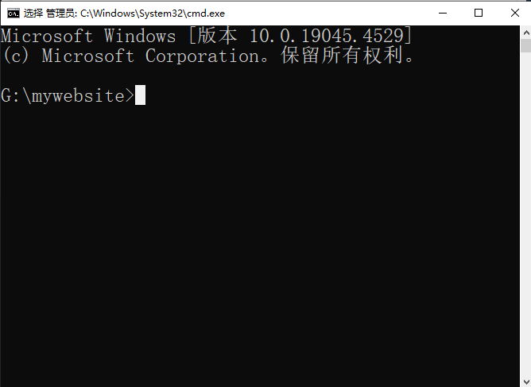

## 课程信息：

>课程说明:

本课程是```《零基础打造 Web3.0 AI超级个体门户》```的先导课程，通过本教程，我们可以学习到一个完全不同的网站构建模式，不需要写代码，不需要购置服务器和数据库和带宽资源，零基础免费搭建一个AI超级个人的门户网站。

>讲师简介：

MetaX，Web3.0 & AI产品经理，```ENS + IPFS dWebsite 项目```发起人，2021年开始独立研发基于HUGO静态网站构建+IPFS的自动化部署的去中心化网站，在Web3.0、AIGC领域具有多年实战项目经验。

>课程特点：

零代码，零成本，零技术基础的小白课程

>学习对象：

内容创作者，对Web3.0对去中心化网站感兴趣的人士

>课程目标：

能够独自的搭建自己的门户网站，并成功部署发布，让全球用户可以访问

---

## 学习要点

- 在本地构建一个静态站点
- 配置网站基本信息，发布第一篇内容
- 部署并成功发布网站


## 课前准备
- 专门安排1个小时完整的学习时间
- 一台可以可以上网的电脑，普通配置，操作系统Windows 10 以上或者MaC系统

## 课程开始


上课了！我们先集中一段时间，抛开其他杂事，集中精力学习下面的内容



我们学习的是通过HUGO框架静态网站构建的方法，因此，这种建站方法和传统网站开发有着根本的区别，我们只需要使用几个命令，就可以快速地在电脑本地构建一个可以在本地浏览访问的网站。

至于HUGO是什么？我们目前只需要知道它是目前最快速的静态网站构建框架程序就可以了，以后我们再专门来介绍HUGO的优势和特点。

接下来，我们做的第一件事情，是先去HUGO的官方网站，下载最新版的HUGO程序。

HUGO最新版下载地址：

```
https://github.com/gohugoio/hugo/releases/tag/v0.128.0
```
这个列表里提供了多个系统运行的程序，我们根据自己电脑的操作系统分别选择下载，

Windows 10 系统下载这个地址：
```
https://github.com/gohugoio/hugo/releases/download/v0.128.0/hugo_extended_0.128.0_windows-amd64.zip
```
MAC 系统可以通过```brew```命令快速安装HUGO，具体操作可详见这里。

## 配置环境

HUGO文件包下载完成后，解开压缩包，会发现有一个hugo.exe的文件，我们把这个文件移动到到C:\bin\目录内


然后开始设置电脑的环境变量，这样我们在电脑任何目录下进行操作时，都可以使用hugo的命令。

我们在桌面```我的电脑```，鼠标点击右键，弹出菜单点最后一个```属性```，打开设置的界面，如下图：


然后在系统设置界面找到```高级系统设置```，点击进入```系统属性```，如下图：


点击右下角的```环境变量```，开始设置系统环境变量。


在系统变量中，我们找到```Path```这一行，

然后双击进入，我们新添加一条记录：```C:\bin\```，注意，字符用英文半角符号。

设置完成后，点击确定完成HUGO环境的配置。

## 构建网站

我们进入到```D盘```根目录下（也可以根据自己电脑情况调整盘符），在文件夹路径地址栏内，删除多余内容，留白，然后输入```CMD```，启动电脑的```COMMAND```命令面板。


然后开始在光标的位置，输入以下命令，后点键盘上的回车键：
```
hugo new site XXXXX
```


这里的```XXXXX```是网站目录的名称，可以自定义，用英文、数字或者_符号，避免使用汉字和其他字符。例如你还不知道叫什么名可以直接先命名```mywebsite```，后面可以再修改。


大概不到3秒钟时间，看到这个界面时，说明站点已经成功创建完毕！

## 站点配置

虽然站点已经创建完成，但是由于新创建的站点还缺乏模板和基本的配置信息，目前还不能浏览访问，所以我们接下来分别处理这两件事情：

首先我们需要获得HUGO站点的模板文件，HUGO的官网提供了很多的站点模板，我们可以通过下面的地址查看并预览：
```
https://themes.gohugo.io/
```
为了方便大家快速上手，我们先直接找一个较为简单的网站模板来做演示，我们用的模板主题名为```doit```

模板文件的下载地址是：
```
https://github.com/HEIGE-PCloud/DoIt/archive/refs/heads/main.zip
```
网站主题模板下载完，然后将压缩包解开，将```Doit```的文件夹复制一份到刚才创建的站点```mywebsite```目录下的```themes```目录内，请注意，主题压缩包解压缩后，文件夹名可能是```Doit-main```这样的，将文件夹名修改成```Doit```即可。


目录的路径和文件夹都放置正确，我们站点的主题模板也就安装完成了。

接下来，我们来配置站点信息，站点基本配置信息我已经为大家准备好，大家只需要按照抄作业即可。

首先我们进入```mywebsite```站点的根目录，可以看到一个```config.toml```的文件


我们可以鼠标右键点击，然后选择用记事本打开，我们可以看到这个界面：


然后将下方的站点基本信息配置文件，完整复制一份到```config.toml```里，覆盖原有的内容后，点保存关闭。

```toml
baseURL = "http://example.org/"
# [en, zh-cn, fr, ...] 设置默认的语言
defaultContentLanguage = "zh-cn"
# 网站语言, 仅在这里 CN 大写
languageCode = "zh-CN"
# 是否包括中日韩文字
hasCJKLanguage = true
# 网站标题
title = "我的全新 Hugo 网站"

# 更改使用 Hugo 构建网站时使用的默认主题
theme = "DoIt"

[params]
  # DoIt 主题版本
  version = "0.2.X"

[menu]
  [[menu.main]]
    identifier = "posts"
    # 你可以在名称 (允许 HTML 格式) 之前添加其他信息, 例如图标
    pre = ""
    # 你可以在名称 (允许 HTML 格式) 之后添加其他信息, 例如图标
    post = ""
    name = "文章"
    url = "/posts/"
    # 当你将鼠标悬停在此菜单链接上时, 将显示的标题
    title = ""
    weight = 1
  [[menu.main]]
    identifier = "tags"
    pre = ""
    post = ""
    name = "标签"
    url = "/tags/"
    title = ""
    weight = 2
  [[menu.main]]
    identifier = "categories"
    pre = ""
    post = ""
    name = "分类"
    url = "/categories/"
    title = ""
    weight = 3

# Hugo 解析文档的配置
[markup]
  # 语法高亮设置 (https://gohugo.io/content-management/syntax-highlighting)
  [markup.highlight]
    # false 是必要的设置 (https://github.com/dillonzq/LoveIt/issues/158)
    noClasses = false
```
好了，到这一步，站点配置也完成了，离查看站点还差最后一步，因为站点现在是个空站点，还没有任何内容，所以我们要先发布一条文章内容。

回到```mywebsite```的文件目录，我们再一次在文件地址栏中输入CMD，再次把COMMAND命令面板请出来，可以看到光标停留的位置是在```mywebsite```后面，说明位置是正确的。



我们在光标闪动的地方，输入以下命令：
```
hugo new posts/myfirstpost.md
```


直到看到这个界面提示时，说明第一篇内容已经创建发布完成了。

## 启动本地网站

那么接下来我们要来启动我们刚才创建的网站，预览一下效果。

我们继续在刚才的COMMAND命令面板内通过```hugo serve```的命令来启动网站。请注意光标所停留的位置一定要确保是在mywebsite的根目录下，否则站点无法正常启动。


直到命令面板显示这些提示时，说明我们的站点已经成功启动了，然后我们就可以通过浏览器来访问我们的站点，站点地址界面信息已经给出，是```http://localhost:1313```，是一个本地的浏览地址，我们打开浏览器，地址栏里输入```http://localhost:1313```看一下效果。


网站的页头和页尾的内容已经都显示出来了，还可以切换主题明暗色调，但是刚才新发布的一篇内容为什么看不到？

由于HUGO站点默认内容的配置信息，包含了草稿状态是开启的，所以这个内容目前还是草稿并未发布，我们可以去修改一下内容的草稿状态就可以了。

我们先找到刚才发布的内容文件，正常情况下，所有发布的内容全部在网站根目录的```content```下的```posts```目录下，我们刚才发布的文章内容在这里：


然后鼠标右键点击用记事本打开


找到文件头里面```draft```，这个就是说明文章的草稿状态，现在默认是```true```，也就是还是草稿状态，我们要修改为```false```，三横杠的区域是文件头部文件，定义了这个文章的标题和发布时间，文章的标题我们可以自由修改，第2个三横杠下面的区域就是我们书写正文的区域，这里可以像我们在其他平台书写内容一样编辑内容，我们可以随便先写点内容，把内容的标题修改一下。修改完成，我们点击```文件```和```保存```即可。关于如何更高效的利用编辑器编辑内容，我们会有专门的课程来讲解，这里就不展开了。

接下来我们在浏览器访问```http://localhost:1313```，修改后的内容已经出现在网站首页了。


我们在本地环境下通过HUGO构建的网站，可以离线进行内容编辑，也可以事实预览效果，等待内容全部编辑完毕后，我们就需要将网站部署发布了。

以前，我们如果要建站，需要去IDC服务商去购买或租赁主机或服务器，还需要购买带宽、数据库等资源。既然我们今天学习这个课程，当然是不需要大家去付费部署发布网站。部署发布网站的方法也很多，我们先从最简单容易的方法开始学习，日后，我们熟练操作后，可以进入高级课程继续了解其他更高效部署和发布网站的方法。

接下来，我们还需要做以下工作：

- 注册开通Github账号

- 将本地站点文件上传到Github的仓库中

- 通过部署平台连接Github仓库，发布网站

## 注册Github

GitHub是一个在线的代码仓库，它像是一个数字图书馆，专门存放和组织电脑程序的源代码。程序员们可以在这里上传自己的作品，与他人共享，也可以下载别人的代码学习或改进。通过GitHub，全球的开发者能够协同工作，共同推进软件项目的开发，确保每次修改都能被记录和追踪，让编程工作更加高效和有趣。

我们打开下面的网址， 不用担心是英语网站，按照我们的步骤一步步走，不会迷路。。。
```
https://github.com/
```
然后点击右上角的```Sign up```，也就是注册,


输入你的email地址，点击```Continue```，然后进入邮箱查收验证码邮件，


然后返回Github网站，填入邮件中的验证码，然后根据安装提示，点```Next```，就可以完成Github账号的注册。

## 下载安装Git

Git是一个可以方便将本地代码文件提交到Github的工具，我们只需要几个命令就可以完成代码文件的提交。


我们先到Git的官方网站下载并安装Git，下载地址如下：
```
https://git-scm.com/download/
```
安装完成后，我们就可以将本地站点文件进行提交了。


## 提交文件到Github

如果要将本地的站点文件上传到Github，我们首先必须先在Github上新建一个仓库，然后将本地站点的文件上传到这个仓库地址中。

登录Github进入主页后，我们可以分别从左侧栏或者首页找到```New```或者```Create a new repository```来新建一个仓库，也可以直接用下面的链接进行创建仓库：

```
https://github.com/new
```


这里我们需要给仓库取一个名称，建议用英文或者数字。我们这里为了演示，新建一个名叫```demosite```的仓库，填写完名称验证通过以后，点击右下角的```Create repository```，仓库就创建成功了。


这就是我们创建好的仓库，目前仓库还是空的，我们接下来就可以用Git来提交本地站点文件了。


首先我们进入本地站点的根目录，在文件夹空白的地方，点击鼠标右键，在弹出的菜单中，我们点击```Open Git Bash here```打开Git的操作面板，我们按照以下步骤逐步进行代码的提交

首先在命令面板输入以下命令，并回车确定：

```
git init
```
这个命令的作用，是在我们站点根目录下初始化一个本地的仓库，操作完成后，我们会发现我们站点的根目录下多出来一个```.git```的文件夹。接下来我们继续在命令面板输入：

```
git add .
```
这一步的目的是将当前目录下所有文件添加到 本地的 Git 仓库。然后继续：

```
git commit -m "new site"

```
可以将以上双引号的内容替换成你自己的提交信息，中英文都可以，目的是给每次提交写一个备注，方便未来查询历次都提交了什么内容。接下来，我们要来连接我们在Github上新建的那个仓库：

```
git remote add origin <Github 仓库 URL>
```
你也可以将 ```origin```替换成仓库名字，英文或数字，然后将 ```<GitHub 存储库的 URL>``` 替换为您已创建的存储库的 URL，如下图，复制这段地址即可。


最后，我们输入下面这行命令，将我们本地仓库的代码，提交到远程Github仓库中：

```
git push -u origin master
```
这样，我们的本地站点代码就推送到Github仓库中了。

!](image-29.png)

## 部署发布网站

接下来我们通过Github的Pages来完成站点的部署。
接下来，我们进入仓库的 ```Setting``` 界面，找到左侧菜单的 ```Pages```，然后将 ```Build and deploymen``` 下的 ```Source``` 修改为 ```GitHub Actions```


然后选择用Hugo来部署，点击 ```Congigure```进入部署环境设置。


左侧的部署代码已经默认填写好，继续右上角的 ```Commit changes``` 按钮


保持默认内容，继续点击 ```Commit changes``` 按钮。

然后我们点击仓库顶部菜单的 ```Actions```


我们可以看到有一个工作流已经创建，点击进去查看


如果我们看到这个界面，说明我们的网站已经部署发布成功！并且日后我们更新网站内容，使用Git提交Github上时，这个工作流会自动帮我们自动部署发布网站。

接下来我们返回到仓库的 ```Setting``` 页面，进入左侧菜单的 ```Pages``页面


我们在这里可以看到我们部署上线后的网站地址。
```
https://bigiod.github.io/demosite/
```


恭喜你！你的第一个通过HUGO构建的站点已经顺利部署发布成功！

当然这只是一个开始，我们的网站还比较简单，后续课程我们还将继续学习深入学习HUGO网站的其他知识点。